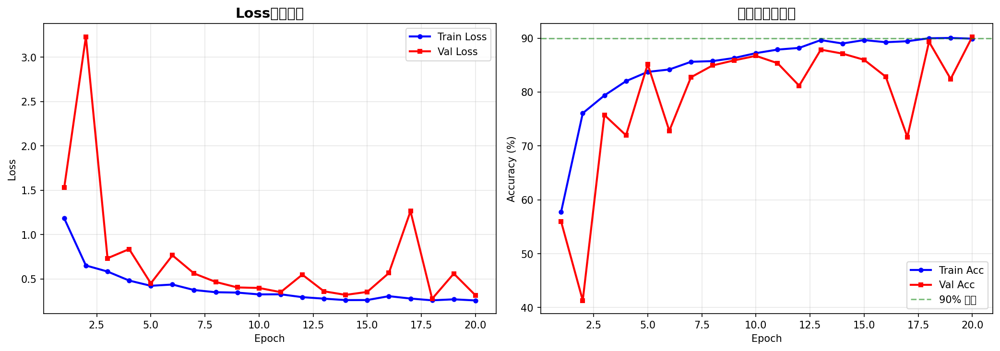
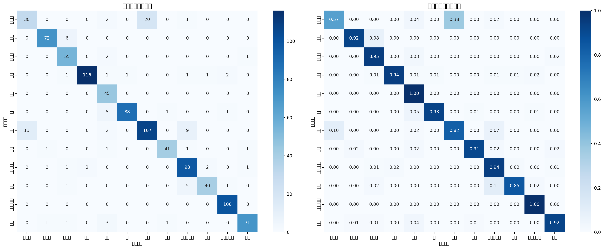
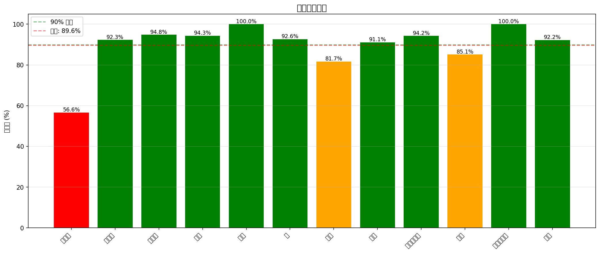
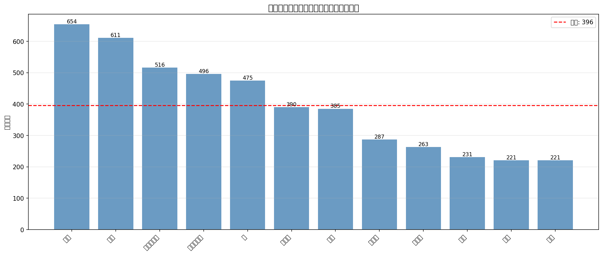
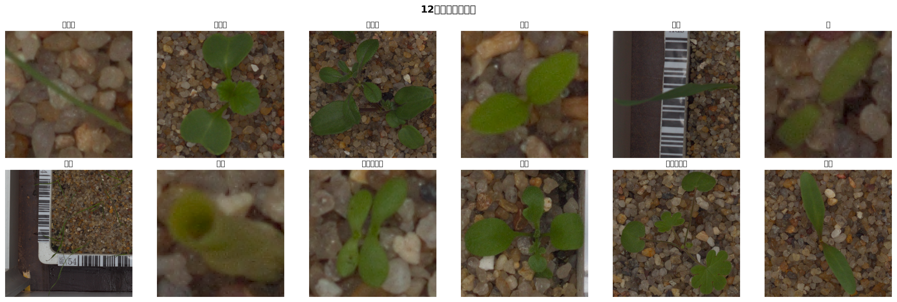

# 🌱 Plant Seedlings Classification（植物幼苗分类）

> 基于 ResNet-101 迁移学习的多分类图像识别项目 | Kaggle Competition

## 📖 项目简介

使用深度学习对12种植物幼苗进行分类识别，采用 **ResNet-101** 预训练模型进行迁移学习，涵盖完整的机器学习项目流程：数据准备、探索性分析、模型训练、评估分析、Kaggle竞赛提交。

**Kaggle竞赛链接：** [Plant Seedlings Classification](https://www.kaggle.com/c/plant-seedlings-classification)

## 🎯 项目亮点

- 🔬 **12类植物幼苗分类** — 处理多类别不平衡数据
- 🧠 **ResNet-101迁移学习** — 复用ImageNet预训练权重
- 📊 **完整混淆矩阵分析** — 深入理解模型表现
- 🎨 **丰富的数据增强** — 提升模型泛化能力
- 📈 **Kaggle竞赛提交** — 端到端ML项目实践

## 📈 训练结果

### 训练曲线


### 混淆矩阵


### 每类准确率


### 类别分布


### 样本展示


## 🗂️ 项目结构

```
├── 1_数据准备.py                   # 数据下载、预处理和划分
├── 2_数据探索与可视化.py           # 探索性数据分析(EDA)
├── 3_ResNet101_训练.py             # ResNet-101模型训练
├── 4_模型评估与混淆矩阵.py        # 模型评估和可视化
├── 6_Kaggle提交.py                 # 生成Kaggle提交文件
├── results/                        # 📊 训练结果可视化
│   ├── training_curves.png         # 训练/验证曲线
│   ├── confusion_matrix.png        # 混淆矩阵
│   ├── per_class_accuracy.png      # 每类准确率
│   ├── class_distribution.png      # 类别分布
│   └── sample_images.png           # 样本展示
├── requirements.txt                # Python依赖
├── .gitignore                      # Git忽略配置
└── README.md                       # 项目说明
```

## 🚀 快速开始

```bash
# 1. 安装依赖
pip install -r requirements.txt

# 2. 数据准备（需要Kaggle API）
python 1_数据准备.py

# 3. 数据探索
python 2_数据探索与可视化.py

# 4. 模型训练
python 3_ResNet101_训练.py

# 5. 模型评估
python 4_模型评估与混淆矩阵.py

# 6. 生成Kaggle提交
python 6_Kaggle提交.py
```

## 🛠️ 技术栈

| 类别 | 技术 |
|-----|------|
| 深度学习框架 | PyTorch |
| 预训练模型 | ResNet-101 (ImageNet) |
| 数据增强 | Albumentations |
| 可视化 | Matplotlib, Seaborn, Plotly |
| 评估指标 | Scikit-learn |
| 竞赛平台 | Kaggle |

## 📊 12种植物幼苗类别

| 编号 | 类别名称 | 中文名 |
|-----|---------|--------|
| 0 | Black-grass | 黑草 |
| 1 | Charlock | 芥菜 |
| 2 | Cleavers | 猪殃殃 |
| 3 | Common Chickweed | 繁缕 |
| 4 | Common wheat | 普通小麦 |
| 5 | Fat Hen | 藜 |
| 6 | Loose Silky-bent | 看麦娘 |
| 7 | Maize | 玉米 |
| 8 | Scentless Mayweed | 无味母菊 |
| 9 | Shepherds Purse | 荠菜 |
| 10 | Small-flowered Cranesbill | 小花老鹳草 |
| 11 | Sugar beet | 甜菜 |

## 🧠 核心知识点

- **迁移学习**：冻结预训练层 → 训练分类头 → 解冻微调
- **数据不平衡处理**：加权交叉熵损失 / Focal Loss
- **残差连接**：解决深层网络梯度消失问题
- **学习率调度**：CosineAnnealingLR / ReduceLROnPlateau
- **数据增强**：随机翻转、旋转、颜色抖动、Cutout等


## ⚙️ 环境要求

- Python >= 3.8
- PyTorch >= 2.0
- GPU（推荐）或 Google Colab

## 📄 License

This project is for educational purposes.

---

*项目3/5 — 深度学习实战系列*
